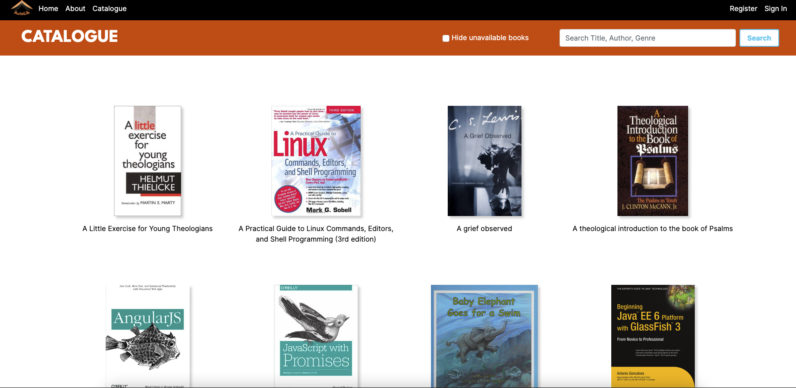

# AutoLib App. 
Developed by [Johannes](https://github.com/jowe81), [Chérie](https://github.com/cherieodu) and [Merwyn](https://github.com/merwynpgithub).

## A system to share books with friends in a Library-like way

## Set up API

### `git clone git@github.com:jowe81/autolib-api.git`
### Follow API instructions and setup the env and Database

## Install the APP

### `git clone git@github.com:merwynpgithub/autolib.git`
### `npm install`
### `npm start`

Open http://localhost:3000 to view it in your browser

